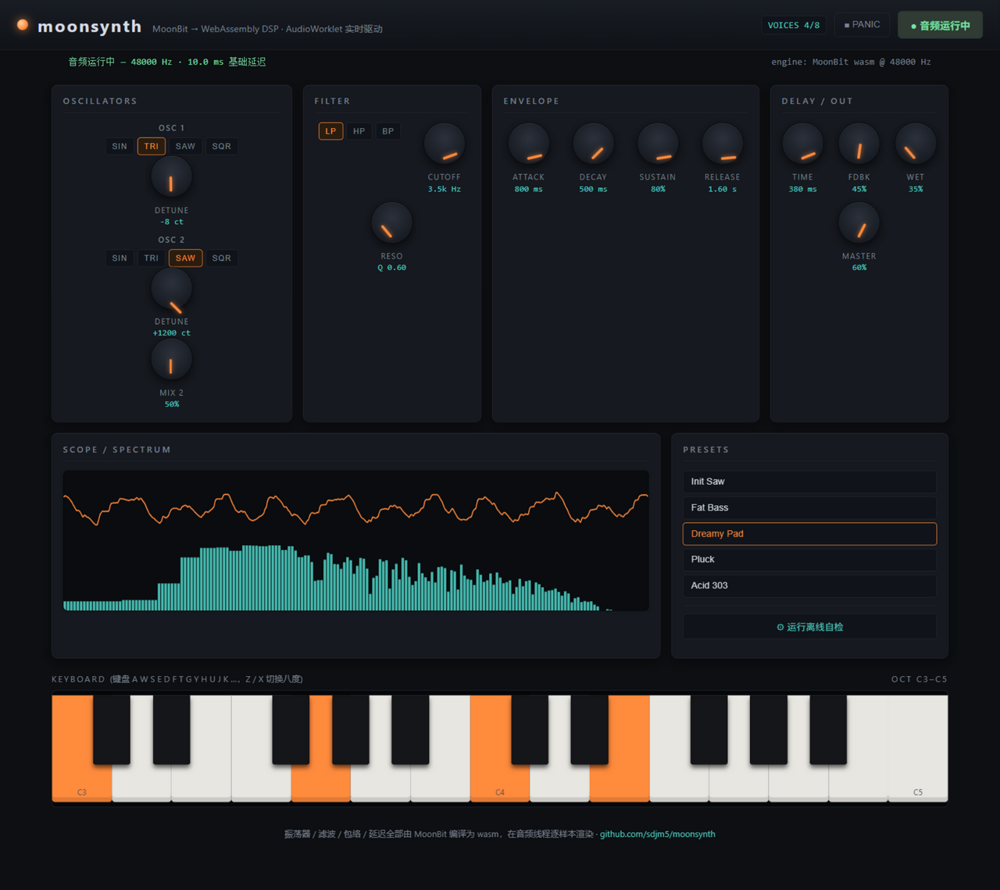

# moonsynth

A polyphonic browser **synthesizer rack** whose entire DSP core — oscillators,
filter, envelopes, delay — is written in [MoonBit](https://www.moonbitlang.com/)
and compiled to WebAssembly, rendered sample-by-sample on the real-time audio
thread through an `AudioWorklet`.



```text
signal flow (all inside the wasm module):

  osc1 ─┐
  osc2 ─┴─ voice mix ── ADSR ─┐
                              ├─ sum ── biquad (LP/HP/BP) ── master ── ping-pong delay ── stereo out
  8 voices ──────────────────┘
```

Turn knobs, play the on-screen keyboard (or your computer keyboard), pick a
preset, and watch the scope. The page's **offline self-test** button renders
audio through the same engine headlessly and asserts the physics: the attack
rings, the release ends in exact silence, and a C4 sine crosses zero at the
right rate.

## Highlights

- **PolyBLEP oscillators** — naive saw/square transitions are corrected with a
  two-sample polynomial band-limited step, taming aliasing at negligible cost
  (worst-case single-sample jump at 440 Hz: 1.98 → 1.48; the harmonic junk
  above Nyquist shrinks accordingly).
- **RBJ cookbook biquad** — low-pass / high-pass / band-pass with resonance,
  coefficients recomputed only on parameter changes.
- **Linear ADSR** per voice, with release rates captured at gate-off so
  parameter tweaks can't make a releasing voice click.
- **Ping-pong delay** — one impulse echoes left, right, left… with feedback;
  circular buffers sized for up to ~1 s bounce time.
- **8-voice polyphony** with note retrigger, idle-voice reuse and oldest-voice
  stealing; a PANIC button hard-silences everything.
- **Zero-allocation render path** — voices, scratch buffers and delay lines
  are preallocated; the per-block render never allocates, so the wasm GC never
  interrupts the audio thread mid-block.

## The wasm ↔ AudioWorklet boundary

One lesson cost the project its first silent render: the AudioWorklet global
scope of some embedded Chromium builds **has no `fetch` and no `URL`**, so the
worklet cannot load the module itself. moonsynth instead compiles the bytes on
the main thread and ships them over the `MessagePort` (`ArrayBuffer` is
structured-cloneable); the worklet instantiates with bare `WebAssembly`.

After that, audio crosses one shared region of the exported linear memory:
each `process()` call asks the engine to render a block of interleaved stereo
f32 samples at an agreed address, and the host copies it to the output
channels. Control events (note on/off, parameters) are plain exported-function
calls on the audio thread — no allocation, no copying, no locks.

Two more findings encoded in the code:

- `OfflineAudioContext` does **not pump the worklet's message queue
  mid-render** — control events must be delivered (and awaited) before
  `startRendering()`, or they never take effect.
- `init` is a reserved special function name in MoonBit; exported constructors
  need another name (`moon_init`).

## Layout

```
src/lib/        portable pure-MoonBit DSP: PolyBLEP oscillators, RBJ biquad,
                ADSR, ping-pong delay, 8-voice synth engine (15 unit tests)
src/kernel/     wasm foreign_library: moon_init / note_on / note_off /
                set_param / panic / voice_count / render (linear-memory out)
web/            rack UI (knobs, presets, keyboard, scope+spectrum),
                audio-worklet.js loader, offline self-test, zero-dependency server
```

## Try it

```
moon build --target wasm
cp _build/wasm/debug/build/src/kernel/kernel.wasm web/synth.wasm
node web/server.mjs 8090
# open http://127.0.0.1:8090
```

Then: **▶ 启动音频** (browsers require one user gesture), pick a preset, and
play with `A W S E D F T G Y H U J K…` (`Z`/`X` shift octaves). Drag knobs
vertically; double-click a knob to reset it. **⚙ 运行离线自检** runs the
automated DSP assertions without needing ears.

## Performance

Rendering 10 seconds of stereo audio with all 8 voices sounding takes
~130 ms in Node (debug build) — a **75× real-time margin** (real-time needs
> 1×). The per-block render allocates nothing.

## Tests

- **DSP library**: `moon test` — 15 unit tests. Exact-value assertions where
  the math is closed-form (envelope timing, filter DC gain, delay bounce
  positions at samples 50/100/150), statistical bounds where the subject is
  signal shape (oscillator range/DC, PolyBLEP jump reduction, filter
  attenuation).
- **In-browser self-test** — offline render through the full worklet stack:
  attack RMS > 0.02, post-release RMS < 0.001, zero-crossing rate within
  230–290/s for a C4 sine (measured 0.25 / 0.00000 / 270).

## Requirements

- MoonBit CLI (developed on 0.1.20260920) — `moon build --target wasm`
- Node.js 18+ for the dev server
- Any modern browser with WebAudio + AudioWorklet for the rack

## License

[Apache-2.0](LICENSE)
